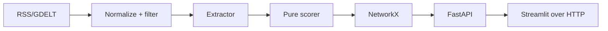

# Geopolitical Risk Radar — Phase 1

A local early-warning walking skeleton for Indian crude-oil supply risk. RSS headlines become typed facts, deterministic scores, route risk, and refinery exposure.

## Run on Windows

Create a Python 3.12 virtual environment, then run `pip install -r backend/requirements.txt`. From `backend`, run `uvicorn app.main:app --reload`; open `http://localhost:8000/docs`. In a second shell, `pip install -r dashboard/requirements.txt`, then from `dashboard` run `streamlit run app.py`. Run offline tests with `pytest -q` from `backend`.

Phase 1 deliberately defers live AIS, graph databases, RAG, learned credibility, PPAC/EIA connectors, Postgres, alerts, maps, React, deployment, and authentication.
