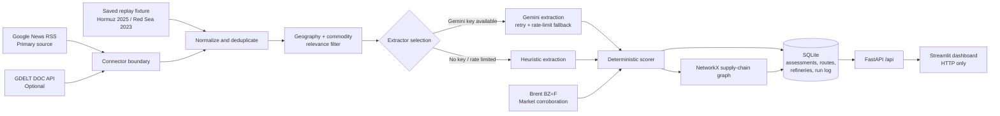
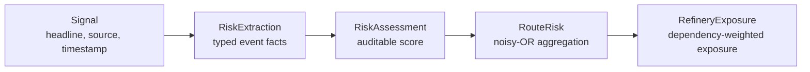

# Geopolitical Risk Radar

> **Phase 1 — Geopolitical early-warning for India’s crude-oil supply chain.**

Geopolitical Risk Radar is a local decision-support system for monitoring news-driven disruption risk across the oil routes that supply Indian refineries. It turns unstructured reporting into explicit, auditable risk facts, scores those facts deterministically, and shows exposure at route and refinery level.

The project is deliberately a **Phase 1 walking skeleton**: a thin but working path through every architectural layer. It is designed to be demonstrable without an LLM key or a reliable GDELT connection.

## Why this matters

India imports most of its crude oil. A disruption around key chokepoints such as the Strait of Hormuz, Bab-el-Mandeb, or Suez can affect shipping routes, refinery inputs, and procurement decisions quickly. This project provides a transparent early-warning workflow rather than requiring analysts to piece those inputs together manually.

## What it does

- Ingests live RSS news as the primary source.
- Treats GDELT as optional: an unavailable source, or one that simply returns nothing new, never stops a run and is never confused with a real result.
- Normalizes and deduplicates syndicated headlines before scoring.
- Filters irrelevant articles before extraction to conserve LLM quota.
- Extracts structured risk facts using Gemini (currently `gemini-3.6-flash`) when a key is configured, retrying once with a stricter instruction on a schema mismatch, and falling back to a deterministic heuristic extractor — automatically and honestly — when no key is available or the free-tier rate limit is hit mid-run.
- Calculates scores with pure Python arithmetic—not with an LLM.
- Aggregates evidence into route risk with noisy-OR aggregation.
- Propagates route risk to Indian refinery exposure through a compact NetworkX supply-chain topology.
- Serves results from FastAPI and renders them with a Streamlit dashboard over HTTP.
- Reports real per-source status, the actual active extractor, and the live extractor mix from `/api/health` — never a hardcoded placeholder — and persists every ingestion run so the operational history survives a restart.
- Computes a cumulative, day-by-day risk trend per route from whatever is currently loaded, for the dashboard's trend chart.
- Replays saved historical scenarios (Hormuz, June 2025; Red Sea / Bab-el-Mandeb, December 2023) using each fixture's own clock, so historical recency stays meaningful, and any new fixture file dropped into `backend/data/fixtures/` is picked up automatically.
- Presents an analyst-facing dashboard — a live status strip, KPI cards, an Intelligence Analytics tab (event types, AI-vs-heuristic provenance, severity/confidence, credibility), and a signal feed — where every number opens a plain-language explanation on click, with no internal jargon or build-phase language exposed to the user.

## Architecture



A replayed fixture bypasses the live RSS/GDELT connectors entirely but joins the identical normalize → filter → extract → score pipeline used for live signals — it is not a separate code path with its own logic.

### Risk data chain



## Scoring model

The LLM extracts facts only. It never assigns a risk score.

```text
signal score = event-type weight × severity × confidence
               × credibility weight × recency weight × speculative weight

recency weight = exp(-age in hours / 48)
route news score = 1 - product(1 - signal score)
route composite = 100 × (0.75 × news score + 0.25 × market score)
```

Market corroboration is applied only when a route already has news evidence. A quiet route therefore stays at `Risk 0 / 100` even if Brent moves globally. Scores are banded as Low (`<30`), Medium (`30–<65`), and High (`≥65`).

## Quick start — Windows

**Fastest path:** once the environment is set up (steps 1–4 below), double-click `run.bat` at the project root. It starts the backend and dashboard together, waits for the API to come up, and opens the dashboard in your browser automatically — no second terminal needed. The steps below are the manual, step-by-step equivalent.

### 1. Prerequisites

- Python 3.12
- Git
- Optional: a Gemini API key for LLM extraction

### 2. Clone and create an environment

```powershell
git clone https://github.com/whatsroopalupto/risk-radar.git
cd risk-radar
python -m venv .venv
.\.venv\Scripts\Activate.ps1
```

If PowerShell blocks activation, use Command Prompt instead:

```bat
.venv\Scripts\activate.bat
```

### 3. Install backend dependencies

```powershell
pip install -r backend\requirements.txt
```

### 4. Configure optional Gemini extraction

Copy `backend\.env.example` to `backend\.env`. Leave `GEMINI_API_KEY` blank to use the built-in `heuristic-v1` fallback. This is a supported mode, not a mock.

### 5. Start the API

```powershell
cd backend
uvicorn app.main:app --reload
```

Open [http://localhost:8000/docs](http://localhost:8000/docs) to inspect and try the API.

### 6. Start the dashboard

Open a second terminal, activate the environment, then run:

```powershell
pip install -r dashboard\requirements.txt
cd dashboard
streamlit run app.py
```

The dashboard opens at [http://localhost:8501](http://localhost:8501).

## Typical demo flow

1. Start the API and open `/docs` (or just run `run.bat`, which starts both services and opens the dashboard directly).
2. On the dashboard, click the status-strip cards (Classification Engine, RSS News, GDELT, Brent Prices, AIS) — each opens a plain-language explanation of what it is and its real current status.
3. Pick a scenario in **Simulation Controls** and click **Replay Selected Scenario** for a guaranteed, instant, reproducible escalation (Hormuz June 2025 or Red Sea December 2023) — the funnel banner is labeled **REPLAY: …** so it's unambiguous this is a saved fixture, not live news.
4. Or click **Run Live Ingestion** to fetch real RSS articles right now — the banner switches to **LIVE DATA**, and the AI-Classified Share KPI reports honestly how much of the run was actually read by Gemini versus the heuristic fallback.
5. Inspect the route chart, the cumulative Risk Trend Over Time chart, and the refinery exposure table.
6. Open the Intelligence Analytics tab to see the extraction output aggregated (event types, AI-vs-heuristic mix, severity/confidence, credibility tiers) — not just listed one signal at a time.
7. Expand a signal's score breakdown in the Signal Feed tab to see every multiplicand.
8. Check the Ingestion History tab — every run (live or replay) is persisted server-side, so this survives a page reload.

## API endpoints

| Method | Endpoint | Purpose |
| --- | --- | --- |
| `GET` | `/api/health` | Real per-source status/fetched counts from the last run, active extractor + reason, live extractor mix, database counts, version |
| `POST` | `/api/ingest/run` | Run live ingestion; accepts `window_hours` |
| `GET` | `/api/ingest/history` | Persisted history of past runs (live or replay), newest first |
| `GET` | `/api/signals` | Recent scored assessments |
| `GET` | `/api/risk/routes` | Route-level risk |
| `GET` | `/api/risk/routes/timeseries` | Cumulative-to-date noisy-OR per route, bucketed by day |
| `GET` | `/api/risk/refineries` | Refinery exposure |
| `GET` | `/api/graph` | Supply-chain graph nodes and edges |
| `GET` | `/api/scenarios` | Every fixture found in `backend/data/fixtures/`, with its id, label, and description |
| `POST` | `/api/replay/{scenario_id}` | Run any saved scenario by id (e.g. `hormuz_june2025`, `red_sea_dec2023`) |

## Tests

All tests run offline against an isolated database — they never touch a developer's real `.env` key or the live demo's `risk_radar.db`, and make no network calls.

```powershell
cd backend
pytest -q
```

The suite (39 tests) validates scoring properties, deduplication, relevance, credibility tiers (including tier 3), heuristic extraction (including multi-spelling chokepoint matching), graph propagation, and API basics, including that a replay actually escalates the expected route.

## Project structure

```text
risk-radar/
├── run.py / run.bat         # one-click local launcher (starts both services, opens the browser)
├── render.yaml              # optional Render.com deployment blueprint (not part of Phase 1 scope; untested)
├── backend/
│   ├── app/                 # FastAPI application
│   │   ├── connectors/      # RSS, GDELT, prices, AIS Phase 2 stub
│   │   ├── pipeline/        # normalization, extraction, scoring, trend calc, orchestration
│   │   ├── graph/           # NetworkX topology and propagation
│   │   └── api/             # HTTP endpoints
│   ├── data/fixtures/       # replay scenarios (Hormuz 2025, Red Sea 2023)
│   └── tests/               # offline pytest suite, isolated database
├── dashboard/               # Streamlit UI; talks only over HTTP
│   └── .streamlit/          # theme config (light, analyst-report style)
└── docs/                    # architecture, ADRs, limitations, accessibility, engineering log
```

## Accessibility decisions

Risk is never indicated by colour alone. Every dashboard indicator contains a numeric `/ 100` score, a band word (Low, Medium, or High), and a text symbol (`▲`, `▲▲`, or `▲▲▲`). The dashboard uses the colour-blind-safe Okabe–Ito blue, orange, and vermillion palette against a light theme, with no emoji or internal build vocabulary in front of the user. The supply-chain graph is accompanied by an equivalent data table.

See [Accessibility notes](docs/ACCESSIBILITY.md) for the Phase 1 constraints and scope.

## Phase 1 scope and deliberate deferrals

This repository intentionally does **not** contain live AIS streaming, Neo4j, RAG or vector databases, learned credibility, PPAC/EIA connectors, Postgres, alerts, maps, React, authentication, or backtesting metrics. Those are later-phase concerns, not missing features. **The project is not finished** — this is a Phase 1 walking skeleton, not the full system.

This lines up with the phased split described in the project synopsis: the synopsis's own Objective 1 (live AIS ingestion), Objective 5 (backtested precision/recall validation), and its PPAC/EIA/Neo4j items are explicitly proposed there as full-scope work, with "scenario simulation and automated procurement rerouting recommendations" named as **Project–II** continuation work. What exists today covers the synopsis's news-ingestion, LLM-based extraction/scoring, supply-chain-graph, and live-dashboard-with-historical-replay objectives on RSS/GDELT + NetworkX; AIS is a real, honestly-labeled stub (not fabricated data), and the backtesting/validation report has not been produced yet.

An optional Render.com deployment blueprint (`render.yaml`, [docs/DEPLOYMENT.md](docs/DEPLOYMENT.md)) exists for hosting the app publicly, but it has not been exercised as part of this Phase 1 build — local execution via `run.bat` is the only verified path.

See [limitations](docs/LIMITATIONS.md), [architecture](docs/ARCHITECTURE.md), the [demo script](docs/DEMO_SCRIPT.md), and the [ADRs](docs/adr/) for the rationale behind these decisions.

## License

This is an academic final-year engineering project. Add a license before reuse or distribution outside its academic context.
