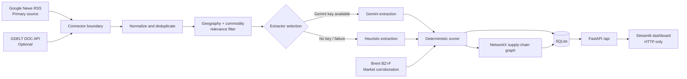
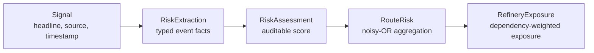

# Geopolitical Risk Radar

> **Phase 1 — Geopolitical early-warning for India’s crude-oil supply chain.**

Geopolitical Risk Radar is a local decision-support system for monitoring news-driven disruption risk across the oil routes that supply Indian refineries. It turns unstructured reporting into explicit, auditable risk facts, scores those facts deterministically, and shows exposure at route and refinery level.

The project is deliberately a **Phase 1 walking skeleton**: a thin but working path through every architectural layer. It is designed to be demonstrable without an LLM key or a reliable GDELT connection.

## Why this matters

India imports most of its crude oil. A disruption around key chokepoints such as the Strait of Hormuz, Bab-el-Mandeb, or Suez can affect shipping routes, refinery inputs, and procurement decisions quickly. This project provides a transparent early-warning workflow rather than requiring analysts to piece those inputs together manually.

## What it does

- Ingests live RSS news as the primary source.
- Treats GDELT as optional: an unavailable source never stops a run.
- Normalizes and deduplicates syndicated headlines before scoring.
- Filters irrelevant articles before extraction to conserve LLM quota.
- Extracts structured risk facts using Gemini when configured, or a deterministic heuristic fallback when no key is available.
- Calculates scores with pure Python arithmetic—not with an LLM.
- Aggregates evidence into route risk with noisy-OR aggregation.
- Propagates route risk to Indian refinery exposure through a compact NetworkX supply-chain topology.
- Serves results from FastAPI and renders them with a Streamlit dashboard over HTTP.
- Replays a saved Hormuz escalation fixture using the fixture’s own clock, so historical recency remains meaningful.

## Architecture



### Risk data chain



## Scoring model

The LLM extracts facts only. It never assigns a risk score.

```text
signal score = event-type weight × severity × confidence
               × credibility weight × recency weight × speculative weight

recency weight = exp(-age in hours / 48)
route news score = 1 - product(1 - signal score)
route composite = 100 × (0.75 × news score + 0.25 × market score)
```

Market corroboration is applied only when a route already has news evidence. A quiet route therefore stays at `Risk 0 / 100` even if Brent moves globally. Scores are banded as Low (`<30`), Medium (`30–<65`), and High (`≥65`).

## Quick start — Windows

### 1. Prerequisites

- Python 3.12
- Git
- Optional: a Gemini API key for LLM extraction

### 2. Clone and create an environment

```powershell
git clone https://github.com/whatsroopalupto/risk-radar.git
cd risk-radar
python -m venv .venv
.\.venv\Scripts\Activate.ps1
```

If PowerShell blocks activation, use Command Prompt instead:

```bat
.venv\Scripts\activate.bat
```

### 3. Install backend dependencies

```powershell
pip install -r backend\requirements.txt
```

### 4. Configure optional Gemini extraction

Copy `backend\.env.example` to `backend\.env`. Leave `GEMINI_API_KEY` blank to use the built-in `heuristic-v1` fallback. This is a supported mode, not a mock.

### 5. Start the API

```powershell
cd backend
uvicorn app.main:app --reload
```

Open [http://localhost:8000/docs](http://localhost:8000/docs) to inspect and try the API.

### 6. Start the dashboard

Open a second terminal, activate the environment, then run:

```powershell
pip install -r dashboard\requirements.txt
cd dashboard
streamlit run app.py
```

The dashboard opens at [http://localhost:8501](http://localhost:8501).

## Typical demo flow

1. Start the API and open `/docs`.
2. Start the dashboard.
3. Use **Run ingestion** to fetch RSS articles, deduplicate, filter, extract, score, and persist them.
4. Inspect the route cards and refinery table.
5. Expand a signal’s score breakdown to see every multiplicand.
6. Run the `hormuz_june2025` replay scenario to demonstrate historical escalation without relying on a live news API.

## API endpoints

| Method | Endpoint | Purpose |
| --- | --- | --- |
| `GET` | `/api/health` | Source state, extractor, database counts, version |
| `POST` | `/api/ingest/run` | Run live ingestion; accepts `window_hours` |
| `GET` | `/api/signals` | Recent scored assessments |
| `GET` | `/api/risk/routes` | Route-level risk |
| `GET` | `/api/risk/refineries` | Refinery exposure |
| `GET` | `/api/graph` | Supply-chain graph nodes and edges |
| `GET` | `/api/scenarios` | Available replay fixtures |
| `POST` | `/api/replay/hormuz_june2025` | Run the saved scenario |

## Tests

All tests run offline. They do not make network calls.

```powershell
cd backend
pytest -q
```

The test suite validates scoring properties, deduplication, relevance, credibility tiers, heuristic extraction, graph propagation, and API basics.

## Project structure

```text
risk-radar/
├── backend/
│   ├── app/                 # FastAPI application
│   │   ├── connectors/      # RSS, GDELT, prices, AIS Phase 2 stub
│   │   ├── pipeline/        # normalization, extraction, scoring, orchestration
│   │   ├── graph/           # NetworkX topology and propagation
│   │   └── api/             # HTTP endpoints
│   ├── data/fixtures/       # replay scenario
│   └── tests/               # offline pytest suite
├── dashboard/               # Streamlit UI; talks only over HTTP
└── docs/                    # architecture, ADRs, limitations, accessibility
```

## Accessibility decisions

Risk is never indicated by colour alone. Every dashboard indicator contains a numeric `/ 100` score, a band word (Low, Medium, or High), and a text symbol (`▲`, `▲▲`, or `▲▲▲`). The dashboard uses the colour-blind-safe Okabe–Ito blue, orange, and vermillion palette. The supply-chain graph is accompanied by an equivalent data table.

See [Accessibility notes](docs/ACCESSIBILITY.md) for the Phase 1 constraints and scope.

## Phase 1 scope and deliberate deferrals

This repository intentionally does **not** contain live AIS streaming, Neo4j, RAG or vector databases, learned credibility, PPAC/EIA connectors, Postgres, alerts, maps, React, authentication, cloud deployment, or backtesting metrics. Those are later-phase concerns, not missing features.

See [limitations](docs/LIMITATIONS.md), [architecture](docs/ARCHITECTURE.md), the [demo script](docs/DEMO_SCRIPT.md), and the [ADRs](docs/adr/) for the rationale behind these decisions.

## License

This is an academic final-year engineering project. Add a license before reuse or distribution outside its academic context.
