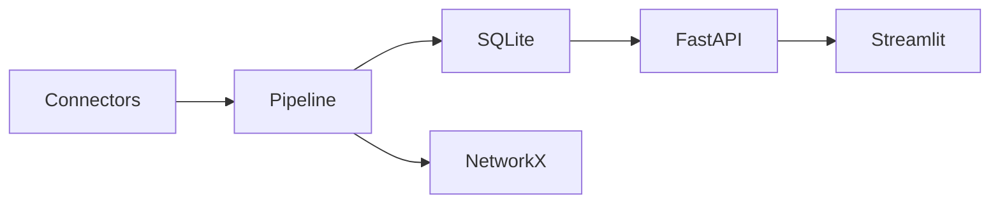

# Architecture

The frozen chain is `Signal → RiskExtraction → RiskAssessment → RouteRisk → RefineryExposure`. Connectors emit signals; normalization and relevance run before extraction. Extractors turn prose into facts; pure scorer functions compute scores; NetworkX propagates route scores using dependency shares. SQLite persists API-ready data.

`score = type × severity × confidence × credibility × exp(-age_hours/48) × speculative`.
For example: blockade `1 × .9 × .5 × 1 × exp(-2/48) × 1 = .432`.

SQLite tables: assessments (signal and score JSON), route_risks, refinery_exposures. The dashboard never imports backend code.
